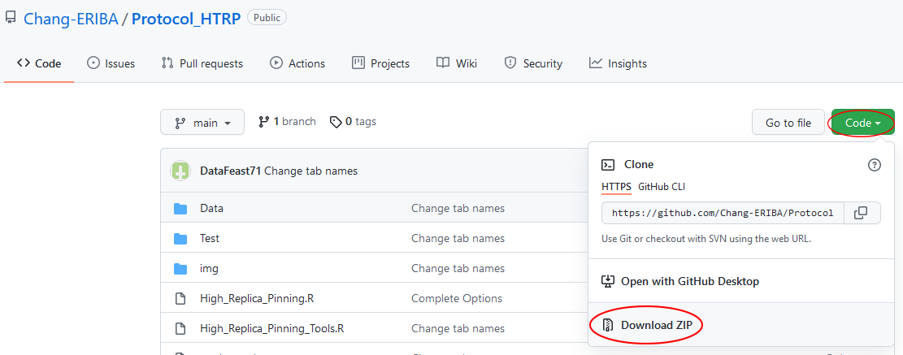

# High-throughput Replica Pinning

- [High-throughput Replica Pinning](#high-throughput-replica-pinning)
  - [Installation of programs and packages](#installation-of-programs-and-packages)
  - [Use](#use)
  - [Output](#output)
  - [Examples](#examples)

This R script will require the next packages alongside with R-version >= 3.6.3:

```r
tidyverse # version 1.3.1
optparse # version 1.6.6
openxlsx # version 4.2.4
```

## Installation of programs and packages

To install R and RStudio follow this [link](https://www.datacamp.com/community/tutorials/installing-R-windows-mac-ubuntu).

Open RStudio.

To install packages or updates, copy the following commands and execute them in R console by pressing ENTER:

<center>

</center>

<br>

```r
pkgs <- c("tidyverse", "optparse", "openxlsx")
install.packages(pkgs)
```

You will get a pop-up window asking you if you want to create a personal libray: select `Yes`. It then asks you to select a CRAN mirror: choose any country from the list that is shown. The packages will be installed.

## Use

To download the Protocol_HTRP stored in this site, choose: `Code` -> `Download ZIP`. Then Unzip this file. Both `High_Replica_Pinning.R` and `High_Replica_Pinning_Tools.R` files need to be in the same directory.

<center>

</center>

To execute the program you need to open a **Terminal** in the working directory where the scripts are located. To select the proper directory, choose: Session -> Set Working Directory -> Choose Directory...

<center>

</center>

Now you can open the **Terminal** by choosing: Tools -> Terminal -> New Terminal

<center>

</center>

You will find yourself in the Terminal:

<center>

</center>

At this point, to execute the program, you can write the following command:

```bash
Rscript High_Replica_Pinning.R -i <Inputfile> -k <Keyfile>  -O <Output_Dir> --Filter <filterValue> --Median_NSP <MedianRatioNSP> --Median_SP <MedianRatioSP>
```

Description:

- Required:
  - \<Inputfile\> : Path to the file with the colony areas data. The plate names need to have the following format:
    - > \<ScreenID\>\<PlateNumber\>_\<NSP-or-SP\>,\<ReplicateNumber\>

  For example, in the Data folder the `colonyAreasA_HR.txt` file one of the plates has the following name:

  > A10_NSP,1,.tif

  Which means: screen ID "A", Plate Number "10", Non-Selective Plate and Replicate "1".

  - \<Keyfile\>   : Path to the keyfile. Th keyfile should be in csv format. If the coordinates in the keyfile are incomplete, the program will complete the file with a 384 format. This file needs to contain the following columns:
    - Plate # : Numbers
    - Row: Letters from **A** to **P**
    - Column: Numbers from **1** to **24**
    - ORF: systematic names of *S. cerevisiae* genes
    - Gene: gene names
    - Mutation (optional; if present it would be used to group and calculate "Total Colonies".)

- Optional Parameters:
  - \<MedianRatioNSP\>: Numeric value between 0-1 that indicates the percentage of the NSP colony size median used as a size threshold to calculate the number of colonies on Non-Selective Plates. By default the value is **0.5**.
  - \<MedianRatioSP\> : Numeric value between 0-1 that indicates the percentage of the NSP colony size median used as a size threshold to calculate the number of colonies on Selective Plates. By default the value is **0.2**.
  - \<filterValue\>    : Numeric value with the threshold to filter low-quality data bases on the total number of colonies per strain on Non-Selective Plates. By default the threshold is **10**.
  - \<Output_Dir\>      : Output directory. By default, a new directory named **Output** will be created.

**Note.** For simplicity, put the Inputfile and the Keyfile in a **Data** folder inside the directory containing the script files. In this way, the path to the files will be: `Data/"filename"`.

**Note.** It is easier to fill in the desired file names and parameters in a text editing program, and then copy and paste the whole command in the Terminal.

Please check the Examples reported at the bottom of this tutorial.

## Output

This script generates an output Excel file with the following name:

> \<ColonyFileName\>\_\<MedianRatioNSP\>\_\<MedianRatioSP\>\_\<filterValue\>\_\<Date\>.xlsx

And the following sheets:

- Raw
- Raw-Ordered
- Ordered
- Ranked
- Filtered
- Counting

## Examples

Alongside with these files, in the Data folder you will find one dataset that can be used in the following examples.

- First example:
  - Input file with colony area data: `colonyAreas_HR.txt` in folder **Data**
  - Keyfile: `MATa_YKO_v5.0_384.csv` in folder **Data**
  - In this case, no `<filterValue>`, `<MedianRatioNSP>` and `<MedianRatioSP>` are specified, therefore the default setting will be used.
  - The output file will be generated int the **Test** folder.

Command for data analysis:

```bash
Rscript High_Replica_Pinning.R -i Data/colonyAreas_HR.txt -k Data/MATa_YKO_v5.0_384.csv -O Test/
```

- Second example:
  - Input file with colony area data: `colonyAreas_HR.txt` in folder Data
  - Keyfile: `MATa_YKO_v5.0_384.csv` in folder Data
  - Filter value = 15
  - Median Ratio NSP = 0.6
  - Median Ratio SP = 0.1

The output will be generated in the Test Folder.

Command for data analysis:

```bash
Rscript High_Replica_Pinning.R -i Data/colonyAreas_HR.txt -k Data/tsMATaKeyFile-384.csv -O Test/ --Filter 15 --Median_NSP 0.6 --Median_SP 0.1
```
